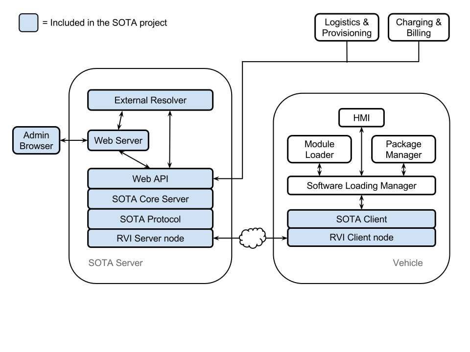
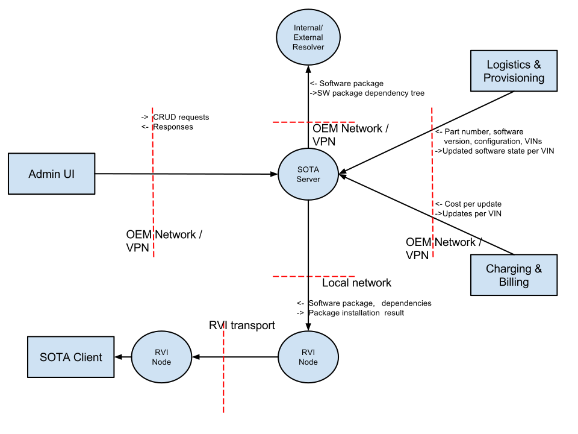
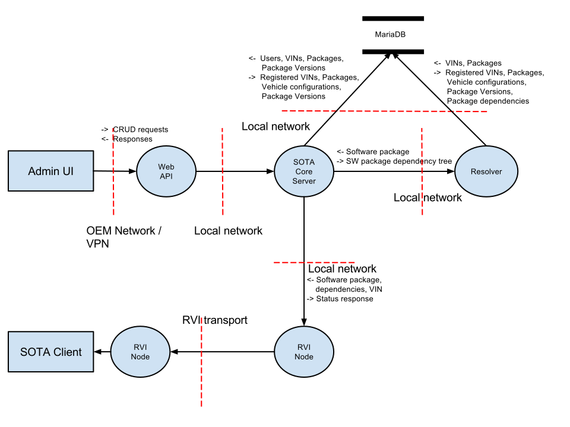

:icons: font

The RVI SOTA system is designed to be a complete, end-to-end solution for managing software updates in a fleet of vehicles. It includes https://github.com/PDXostc/rvi_sota_server[a server infrastructure] to manage vehicles, update campaigns, and software components, and https://github.com/PDXostc/rvi_sota_client[a client] that is installed on an in-vehichle GENIVI system. The server can push updates to the client, as well as notify clients via SMS when there is an update available. The server also implements dependency management, powerful targeting and filtering tools, and more.

The server is split up into three main components. There is a https://github.com/PDXostc/rvi_sota_server/tree/master/web-server[web server], which exposes all server-side functionality, both via a web GUI to get up and running quickly, and via a REST API to interface with OEM logistics and provisioning systems, billing systems, authorization servers, or independent GUI implementations. The https://github.com/PDXostc/rvi_sota_server/tree/master/core[SOTA core server] is what takes care of the actual communication with the client: it notifies the client of updates, sends the package binaries and metadata, keeps track of the status of ongoing, pending, and completed updates, and so on. The https://github.com/PDXostc/rvi_sota_server/tree/master/external-resolver[resolver] is the component that takes care of the business logic of which updates apply to which vehicles, based on administrator-defined filters, dependencies, or whatever else might be required.

Both the core and the resolver implement REST APIs internally, but are only exposed to the outside world through the web API.

This project includes a fully functional and feature-complete resolver component, but the reason the resolver is architecturally separate from the core is to allow independent implementations by individual OEMs suitable to their own needs.

The system architecture is illustrated here:

The data model for the system is illustrated link:../images/Data-Model.svg[here].

== Context Diagrams

RVI SOTA is designed with security in mind. You can read a lot more about our security processes on the link:../doc/contributing.html[contributing], link:../sec/whitelisted-interactions.html[whitelisted interactions], and link:../sec/security-threats-mitigations.html[security threats/mitigations] pages, but for a broad view of how the architectural design of the project helps keep it secure, you can take a look at these context diagrams.

=== Level 0

=== Level 1 SOTA Server

== Requirements

You can find a complete list of the link:../ref/requirements.html[software requirements here]

== Dependencies

You can find a complete list of link:../ref/dependencies.html[software dependencies here]
