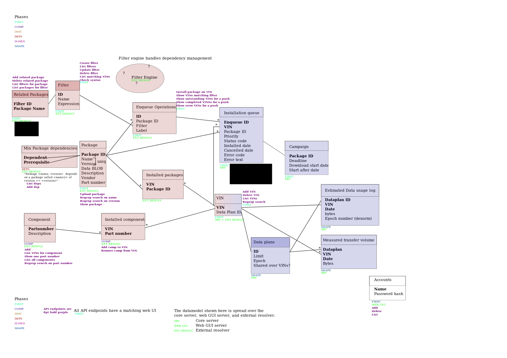

[[sota-architecture]]
= SOTA Architecture

The SOTA System includes a client and server, communicating using the
RVI protocol. The SOTA Server is comprised of three sub-modules:

* https://github.com/PDXostc/rvi_sota_server/tree/master/core[core] -
The central component of the SOTA server that implements package queuing
and distribution
* https://github.com/PDXostc/rvi_sota_server/tree/master/external-resolver[external-resolver]
- An implementation of a package resolution server, which maps VINs to a
list of software components to be installed on a vehicle
* https://github.com/PDXostc/rvi_sota_server/tree/master/web-server[web-server]
- The web interface to the SOTA server, allowing administration of
vehicles and software components

The client is a standalone project hosted
https://github.com/PDXostc/rvi_sota_client[here].

The system architecture is illustrated here:

image:../images/System-Architecture-Diagram.svg[System Architecture
Diagram]

The data model for the system is illustrated here:

[[context-diagrams]]
== Context Diagrams

[[level-0]]
=== Level 0

image:../images/Level-0-Context-Diagram.svg[Level 0 Context Diagram]

[[level-1-sota-server]]
=== Level 1 SOTA Server

image:../images/Level-1-SOTA-Server-Context-Diagram.svg[Level 1 Context
Diagram]

[[requirements]]
== Requirements

You can find a complete list of the
link:../ref/requirements.html[software requirements here]

[[dependencies]]
== Dependencies

You can find a complete list of link:../ref/dependencies.html[software
dependencies here]
