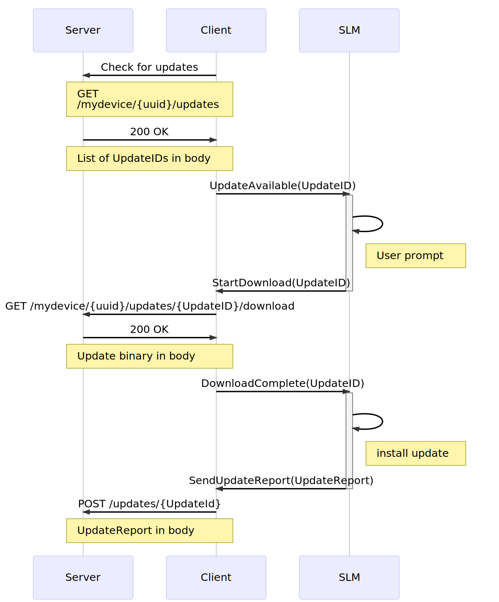

== Developing a SOTA client

A SOTA server isn't very useful unless it has clients to talk to. We provide a link:https://github.com/genivi/rvi_sota_client[reference implementation of a client], but you're also free to implement your own client. If you want to develop an RVI-based client, the reference documentation you're looking for is over link:../dev/client-implementation.html[here], or if you're going to communicate with Core's API endpoints directly you should look at the link:../dev/api.html[Core API Documentation].

== Understanding the reference client

The SOTA client is, in a nutshell, a middleman. It receives update notifications from Core, and downloads the update packages. It then passes them to a software loading manager (SLM) for installation. (For a reference implementation of an SLM, see https://github.com/GENIVI/genivi_swm[the GENIVI SWM]). Once the software loading manager is finished, it sends a report on the install, which the SOTA client passes back to Core.

It does all this through a command/event infrastructure: it broadcasts events, and listens for commands. For more detail, see the link:../cli/client-commands-and-events-reference.html[SOTA client command and event reference].

A flow for the installation of a single update might look like this:

.Update flow (HTTP transport, RVI disabled)

The reference client can communicate with SOTA Core in two ways, configurable on client startup. If you want to use RVI nodes, you can enable RVI communication and disable HTTP communication. If you prefer to let the client communicate with SOTA Core directly over HTTP/HTTPS, it can also do that. See link:../cli/client-startup-and-configuration.html[Client Startup and Configuration] for detailed configuration information.
